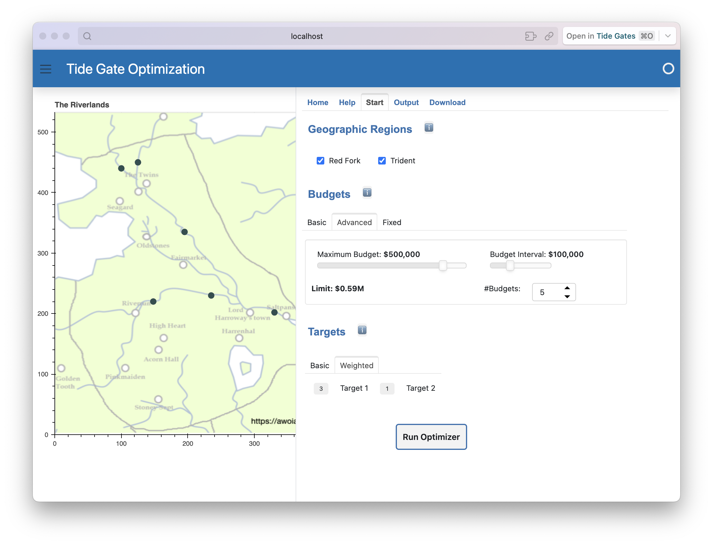
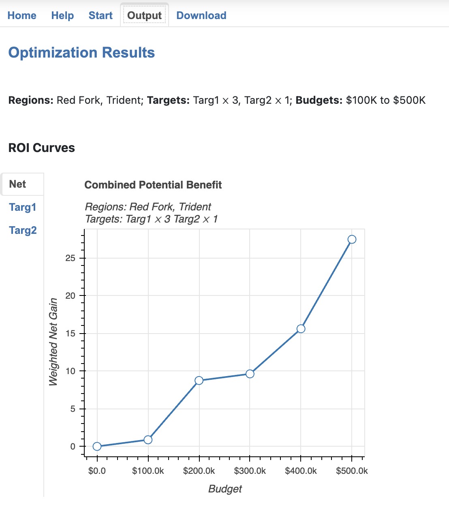
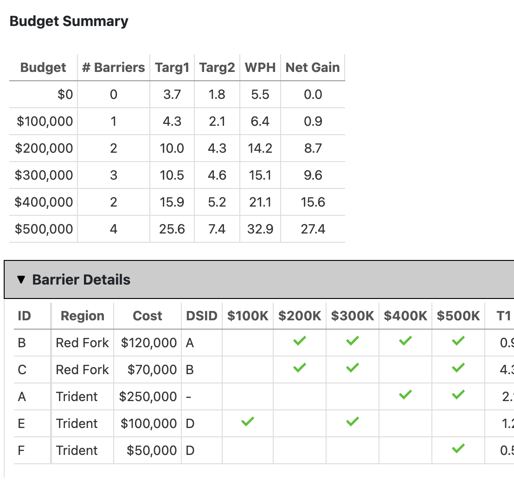
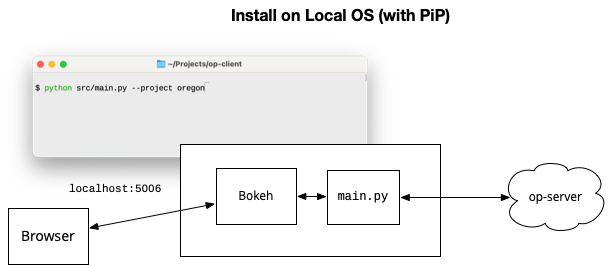
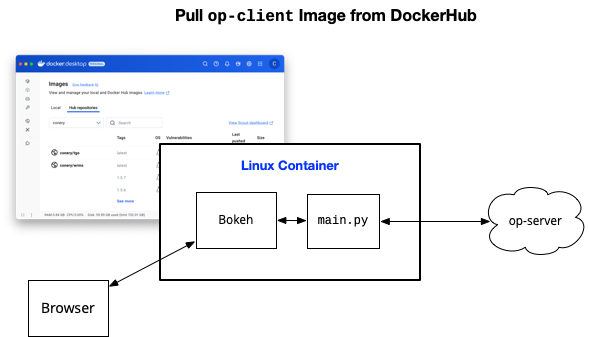
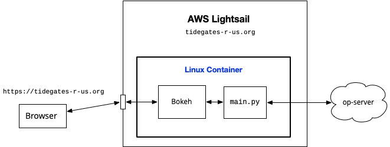

# A Web App for OptiPass™

The Migratory Fish Passage Optimization Tool (OptiPass), is an application developed by Jesse O'Hanley at [Ecotelligence® LLC](https://www.ecotelligence.net/home/optipass).  

The application is written in Visual C++ and runs only in a Microsoft Windows environment.  To make it more accessible to web applications we developed a REST server named [`op-server`](https://github.com/conery/op-client) that runs on a Windows VM and acts as an abstract interface to OptiPass .  

`op-client` is a web application the provides a graphical user interface to `op-server`.
It can be set up to run on any Linux, macOS, or Windows host.
A user just has to start a web browser and point it to the client.
Running OptiPass is simply a matter of setting optimization parameters using familar GUI elements like buttons and sliders and then clicking a "run" button.
Outputs are display in charts and tables in the browser, and can be downloaded for later use offline.

## Demo

The screenshot below shows the graphical user interface.

In this example, the client has connected to a server and requested data from the "demo" project.
This is a small data set from the OptiPass User Manual.
It has six tide gates, named A through F.
B and C are on the Red Fork river, the rest are on the Trident River.

> _The example in the User Manual does not give names to the rivers.  The names and map shown here are from an imaginary territory.  We gave the rivers names in order to show how the GUI works._

To set up an optimazation run, the user clicks next to river names, which shows the locations of the gates on the map.  In this screenshot both rivers are selected so all six gates are highlighted.

The user then chooses budget levels.  In this case, OptiPass will run five times, with budgets ranging from $100,000 to $500,000.

The last step is to choose optimization targets.  In this case the user has decided target T1 should be given three times as much weight as T2.

When the Run Optimizer button is clicked the client sends these settings to a remote server that is running the `op-server` software.
That will be a Windows system that has OptiPass installed.
After OptiPass has completed all five optimizations the results are collected and sent back to the client.

The client presents the results as a set of ROI (return-on-investment) curves:

Below the graphs are tables that show details of the optimization calculation:

## Deployment Scenarios

There are three ways to set up a client.
Each approach is outlined briefly here.
Below that is a discussion of the pros and cons of each approach.
If you decide you want to use on of the methods to set up your own client you can find detailed instructions in the [Deployment](deploy.md) section.

### Option 1: Install Locally

The first option is to install the code on your own computer.
This process if very similar to the steps used to install Jupyter and use it to edit IPython notebooks.

The `op-client` software is written in Python and uses a library named Panel to display the graphical user interface.
Once installed, open a terminal window and type a command that runs the Python program.
Python creates a small special-purpose web server (named Bokeh), then you open a browser on your system and connect to the Bokeh server.

### Option 2: Docker Container

This option is similar to Option 1, in that the client software will run on your computer.
The difference is that you do not install any Python code.
Instead, download ("pull") a Docker image from DockerHub.
It will have all the code preinstalled in a self-contained Linux system.

Then all you need to do is launch a container based on this image.
A Bokeh server will be running inside the container.
To use the client open a web browser and connect to the server.

### Option 3: Container at a Cloud Service

This option is just like Option 2, except now the container is running at Amazon Web Services (AWS) or some other cloud computing environment.

Setting up a new server based on a Docker image is very straightforward.
For example, AWS has a service called Lightsail.
You simply log in, choose some settings based on the level of service you want (based on how much traffic you expect), give it the name of the Docker image, and AWS does the rest.

You can also associate a domain name with your new container so that other users can connect to your client.
For example, if you own the domain `tidegates-r-us.org` you can set it up so it refers to your service at AWS and then other users can point their browswers to `https://tidegates-r-us.org`.

## Comparing Scenarios

Which scenario is best depends on who will be using the client and what their goals are.

#### Software Developer

If you want to download the software to see how it works and perhaps adapt it for your own use Option 1 is best.
You probably already have Python installed and are familiar with installing libraries with Pip so installing `op-client` will be very straightforward.

#### Data Scientist

If you want to use the client yourself but don't expect to dig into the source code consider Option 1 or 2.

If you have Docker on your system already then Option 2 is clearly the easiest approach.

If you don't have Docker, consider installing it.
Docker is widely used in data science and odds are you will encounter other projects that are distributed as Docker images.
Installing Docker is straightforward.
There is a little learning curve the first time you use it, but overall the process is not much more complicated than installing a new Python library.

#### Project Administrator

If you want to configure an OptiPass server with data for your project and an OptiPass client that will let other project members or stakeholders access the server then Option 3 is your best choice.

You could try Option 1 or Option 2, but it would mean (a) setting up a server on a system within your organization that everyone can access and (b) either installing Python and the client software or Docker on every other group member's system.

It may take some initial effort to create an account at AWS and work through the process of launching a new service but in the end it will be far easier for other group members.

